<a href="https://github.com/bsurai/school-ratings-in-ukraine/blob/main/README.md">< Усі рейтинги</a>

<h1>Кореляція між предметами НМТ 2024 року</h1>

На НМТ предмети діляться на обов'язкові (українська мова, історія, математика) та на вибрікові предмети (фізика, хімія, біологія, географія, іноземні мови). Спробуємо розпізнати, як бали з вибіркових предметів пов'язані із балами з обов'язкових предметів. Наведені дані не слід сприймати, як причинно-наслідкові зв'язки.

У більшості випадків вищі оцінки з додаткових предметів співпадають із вищими оцінками з обов'язкових предметів. Тобто сильні учні, як правило, сильніші з усіх предметів. Виключеням з цього правила є учні, які здавали англійську мову. З якоїсь причини дуже важко помітити відповідність між високими балами за англійської мови та іншими предметами.

Графіки побудовані на основі відкритих <a href="https://zno.testportal.com.ua/opendata">даних УЦОЯО</a>.

<h3>Фізика</h3>

Для учнів, які обрали фізику, на графіках є характерним майже пуста нижня права область. Це вказує на те, що учні із високими балами з фізики часто показують високі результати з обов'язкових предметів, навіть з гуманітарних предметів - українська мова та історія.

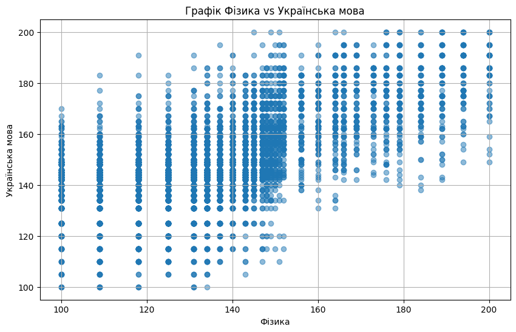
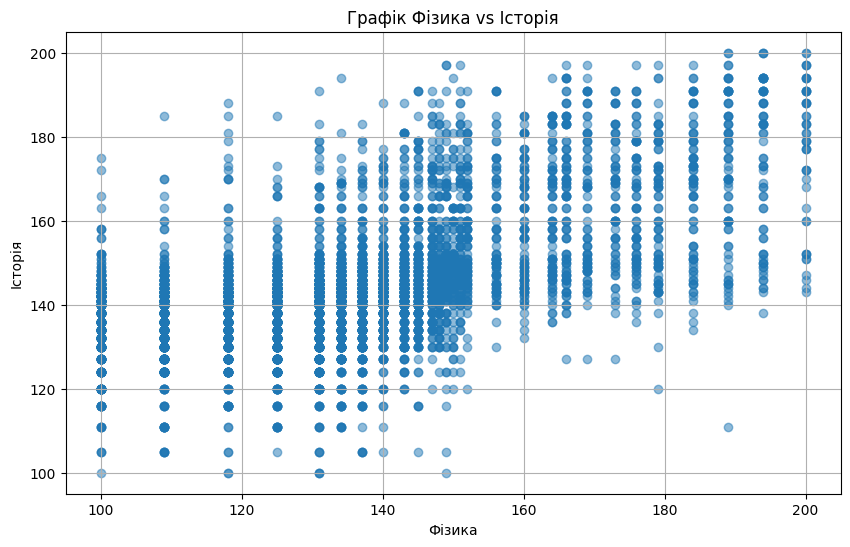
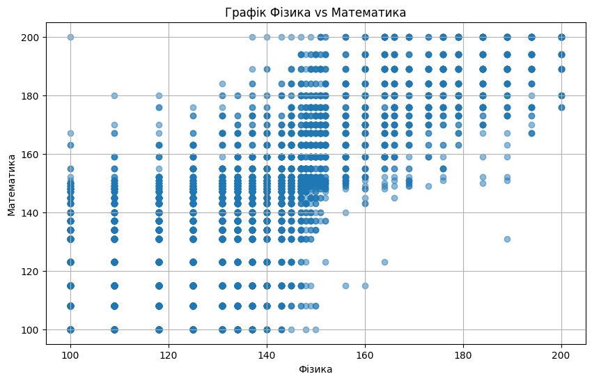

<h3>Хімія</h3>

Графіки з хімії дуже подібні до графіків з фізики. Для учнів, які обрали хімію, на графіках є характерним майже пуста нижня права область. Це вказує на те, що учні із високими балами з хіміх часто показують високі результати з обов'язкових предметів, навіть з гуманітарних предметів - українська мова та історія.

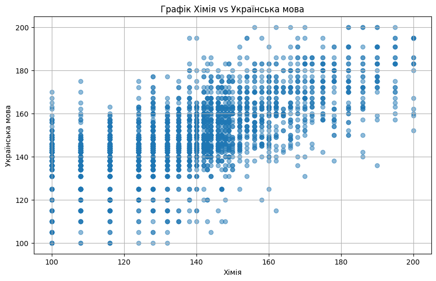
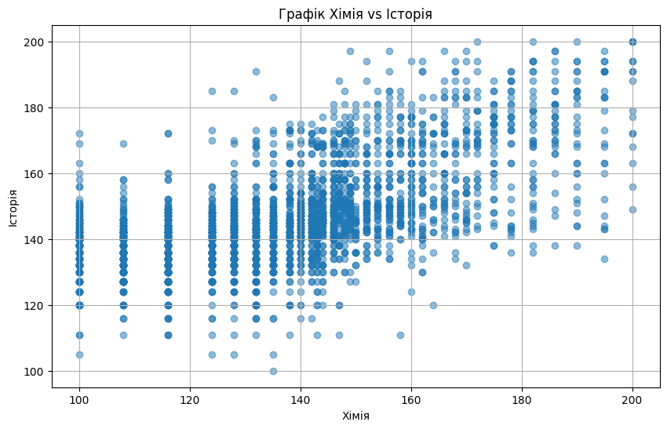
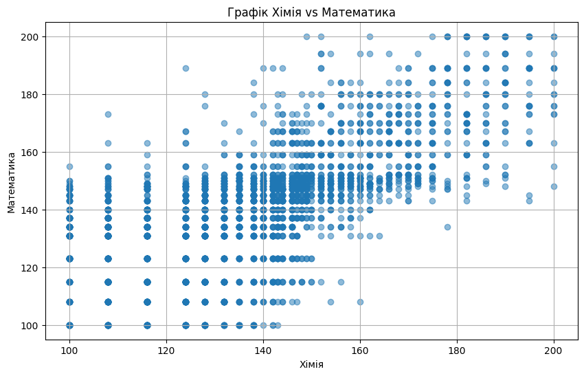

<h3>Біологія</h3>

Відмінність із біологією полягає в тому, що нижній правий квадрат має більше синіх точок, ніж це було для фізики та хімії. Особливо це стосується залежності між біологією та математикою. Це вказує на те, що навіть отримавши високі оцінки з біології учні були схильні отримувати посередні або навіть низькі оцінки з обов'язкових предметів. Із обов'язкових предметів найслабшим для учнів виявилась математика.

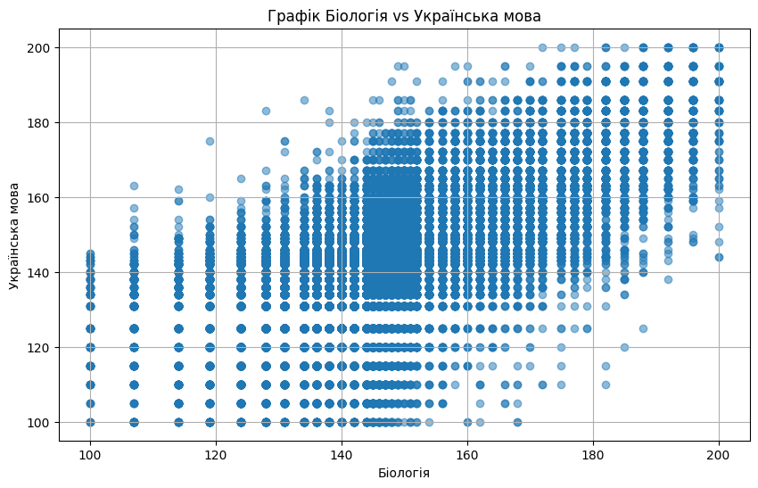
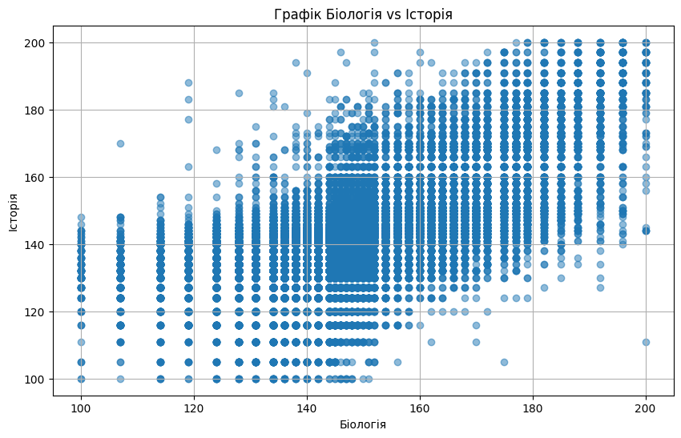
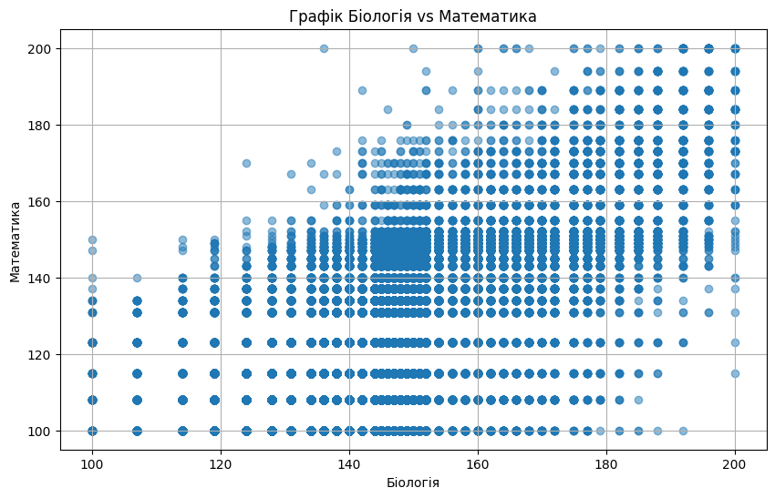

<h3>Географія</h3>

Графіки з географії подібні до хімії та фізики для гуманітарних предметів. Але для математики ми бачимо більше синіх точок в нижньому правому куті, що вказує на те, що багато учнів можуть добре знати географію і слабо володіти математикою.

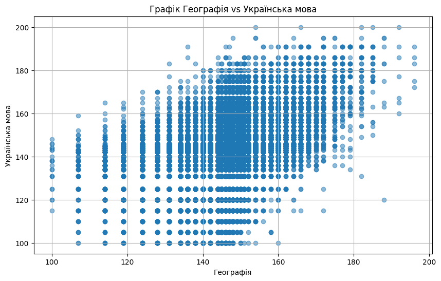
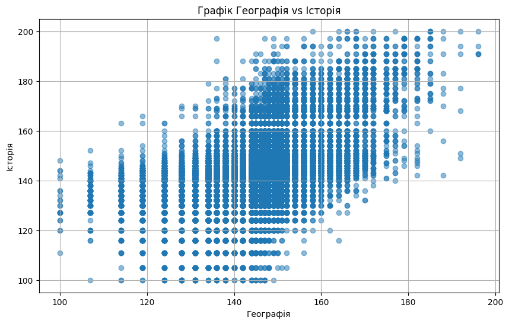
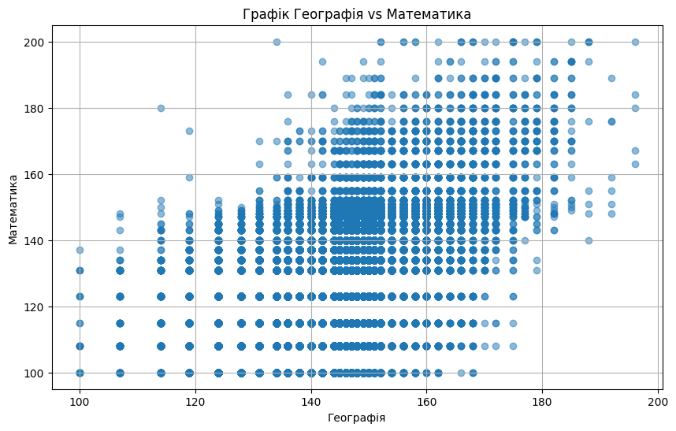

<h3>Англійська мова</h3>

Із англійською мовою найскладніших випадок. Видно, що сині крапки займають майже всю площу графіків. Це означає, що учні з високим рівнем англійсьокої мови могли показати низький рівень з обов'язкових предметів. Так само, учні з високми показниками з української мови, історії, математики могли показати низькі рівні з англійської мови. Частково це можна пояснити тим, що багато дітей в еміграції більше уваги приділяли іноземним мовам, ніж іншим предметам.

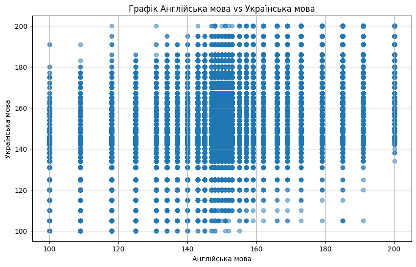
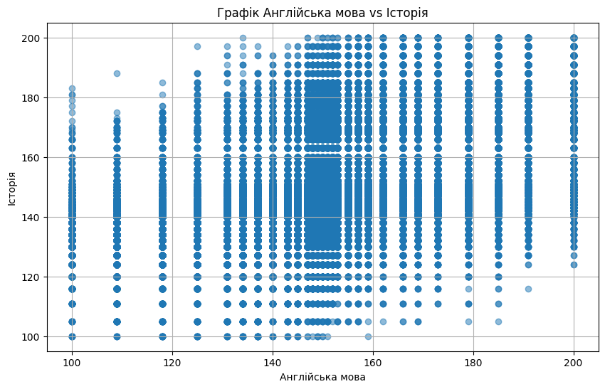
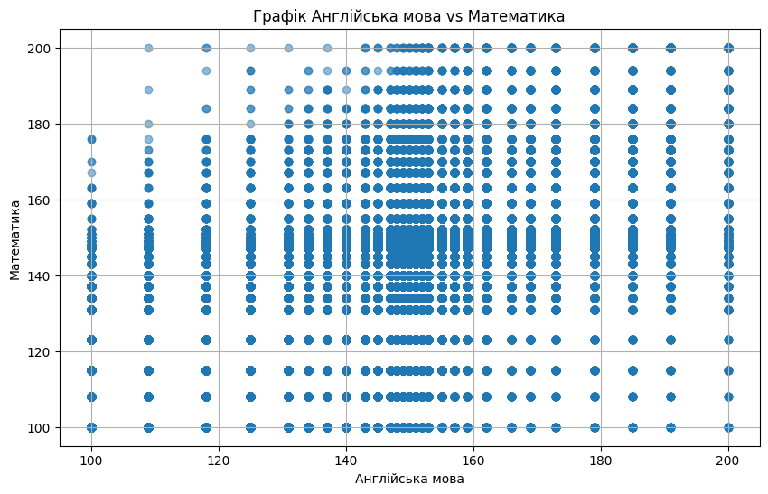
